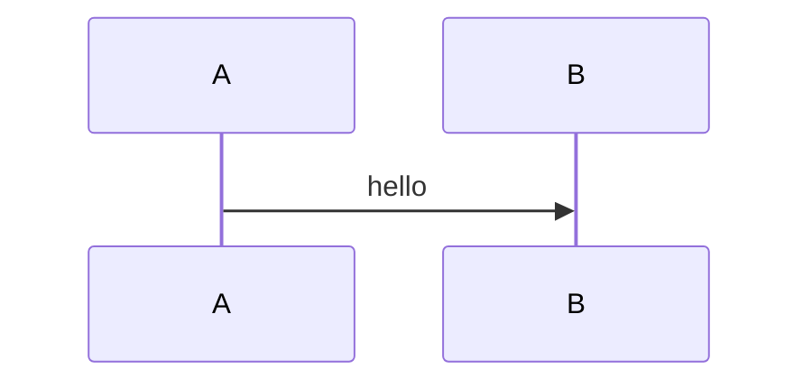

## 简介


[官网文档](https://mermaid-js.github.io/mermaid/#/)


## 流程图

```
graph TB
    A-->B
    A-->C
    B-->D
    C-->D

```


```mermaid
graph LR
    A-->B
```

## 时序图



```mermaid
sequenceDiagram
    A->>B: hello

```


## 甘特图


## 类图


## git图


## 用户地图


